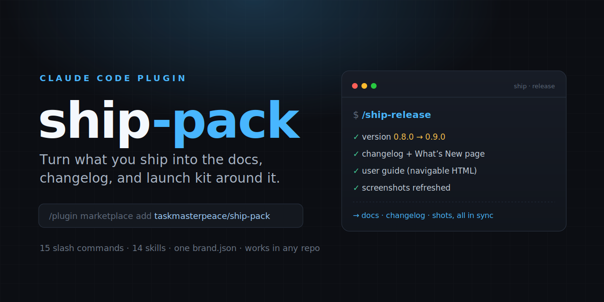
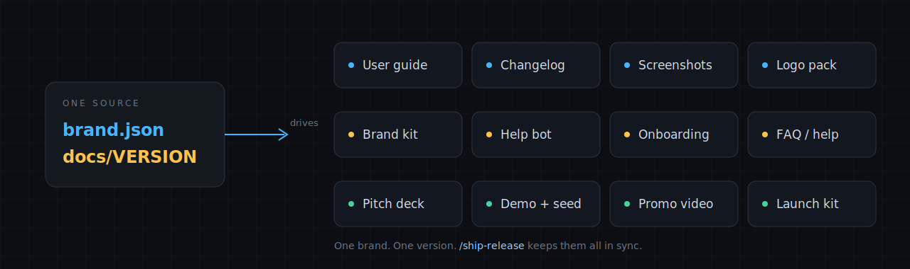

<p align="center"></p>

<p align="center">
  
  
  
  
</p>

<h1 align="center">ship-pack</h1>
<p align="center">Docs + release toolkit for Claude Code: versioned user guides, benefit-first changelogs, screenshots, logos, a brand kit, an embeddable help bot, demo/onboarding/pitch/press kits — all driven by one docs/brand.json + docs/VERSION.</p>

## ⚡ Install

```
/plugin marketplace add taskmasterpeace/ship-pack
/plugin install ship-pack@ship-pack-marketplace
```

That's it — all **15 commands** and **14 skills** load in every project. Prefer not to use a marketplace? See [drop-in install](#-drop-in-install-no-marketplace).

## 🧭 How it works

Your markdown is the **source**. One `docs/brand.json` (your colors + fonts) and one `docs/VERSION` (a semver) drive everything — so your guide, changelog, and screenshots never drift apart. `/ship-release` runs the whole pipeline in a single command.



## 🧩 Commands

### 🚀 Release & docs

| Command | What it does | Writes |
|---|---|---|
| `/ship-release` `major · minor · patch` | Cut a whole release in one command — bump the version, write the changelog, re-stamp & re-render the user guide, and refresh screenshots, all in sync. | `docs/VERSION, SHIPPING-LOG.md, the guide, whats-new.html` |
| `/ship-changelog` `"last 7 days" · "since v0.7.0" · minor` | Turn git history into a benefit-first changelog grouped by version, then render a themed "What's New" page. Scope by date, version range, or author. | `docs/SHIPPING-LOG.md, docs/whats-new.html` |
| `/ship-guide` `focus area` | Build or update a full-depth user & admin guide, then render it to a navigable HTML page (sidebar TOC, search, scroll-spy). | `docs/user-guide.md + .html` |
| `/ship-screenshots` `--dry-run · --only ids` | Capture consistent app screenshots (fixed viewport, redaction, callouts) and drop them into the guide's [SCREENSHOT] markers. | `docs/…/screenshots/*.png` |

### 🎨 Brand & visuals

| Command | What it does | Writes |
|---|---|---|
| `/ship-logos` `new · name` | Detect an existing logo and refine it (or design fresh) — a tailored prompt set: minimalist, monochrome, comfortable, premium + icon/wordmark/monogram. | `docs/brand/logo-brief.md, logo-prompts.json` |
| `/ship-brand` | Generate a full brand kit from brand.json — palette (50–900 + WCAG-checked pairs), type scale, favicon + app-icon manifest, social avatar/banner, OG image. | `docs/brand/*` |

### 💬 In-app & support

| Command | What it does | Writes |
|---|---|---|
| `/ship-helpbot` | Build an embeddable "ask the guide" assistant — a retrieval index, a <ship-helpbot> web component, and a model-pluggable /api/ask-docs route that answers with citations. | `docs/guide-index.json, public/ship-helpbot.js` |
| `/ship-onboarding` | Generate an in-app first-run tour / coachmarks from the guide's main workflows, themed from brand.json. | `docs/onboarding.json + tour component` |
| `/ship-faq` | Build a help center from the guide — a real-question FAQ, canned support replies, and a searchable, on-brand help page. | `docs/FAQ.md, docs/help.html` |
| `/ship-feed` | Turn the shipping log into data — changelog.json + an RSS/Atom feed + a <ship-changelog> web component for a company-page "What's new". | `docs/changelog.json, changelog.xml` |

### 📣 Growth & launch

| Command | What it does | Writes |
|---|---|---|
| `/ship-email` `audience` | Turn a release into a customer email (HTML + text), an in-app "What's new" modal, and a short social post — audience-tailored. | `docs/announcements/<version>/` |
| `/ship-pitch` | Generate an investor one-pager + slide-by-slide deck outline from your brand, momentum stats, and guide — never fabricates a metric. | `docs/pitch/one-pager.md + .html, deck-outline.md` |
| `/ship-demo` `focus` | Discover your data model and write an idempotent, obviously-fake seed + a guided live-demo script. | `seed script, docs/demo/script.md` |
| `/ship-promo` `15s · 60s · feature` | Turn what you shipped into a promo-video plan — voiceover script, timed shotlist, storyboard, + generator-ready prompts. | `docs/promo/*` |
| `/ship-press` | Generate a launch kit — a press release, Product Hunt assets, and a launch-day checklist. Public-safe, zero fabricated quotes. | `docs/press/*` |

## 🚢 Cut a release

Run one command and the whole release stays in lockstep:

```
/ship-release minor
  ✓ version      0.8.0 → 0.9.0
  ✓ changelog    new "## v0.9.0" entry + What's New page
  ✓ user guide   re-stamped "Current as of v0.9.0" + re-rendered
  ✓ screenshots  refreshed for anything that changed
```

Omit the bump and it infers `patch` / `minor` / `major` from your commits and tells you why.

## 🎨 Themed from one brand.json

Drop a `docs/brand.json` in any project and every output is on-brand — no CSS edits:

```json
{ "name": "MyApp", "tagline": "…",
  "colors": { "brand": "#0056D2", "accent": "#FFDD00" },
  "fonts":  { "display": "Bricolage Grotesque", "body": "Hanken Grotesk" } }
```

Different app → different `brand.json` → everything re-themes.

## 📦 Drop-in install (no marketplace)

Copy `skills/*` into `~/.claude/skills/` and `commands/*` into `~/.claude/commands/`. Done.

## 🔄 Update

Edit any skill, then re-pack and push:

```bash
node tools/pack.mjs --out . --repo taskmasterpeace/ship-pack --version 1.1.0
git commit -am "v1.1.0" && git push
```

## 📄 License

MIT © Machine King Labs
